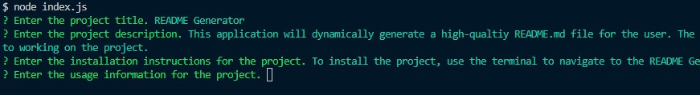

# README Generator
  

  ## Description

  This application will dynamically generate a high-qualtiy README.md file for the user. The command line will display a series of easy-to-follow prompts that allows the project creator to devote more time to working on the project.

  ## Table of Contents

  - [Installation](#installation)
  - [Usage](#usage)
  - [License](#license)
  - [Contributing](#contributing)
  - [Tests](#tests)
  - [Questions](#questions)

  ## Installation

  To install the project, use the terminal to navigate to the README Generator directory and use the Node.js command 'npm i' to install dependencies.

  ## Usage

  
  
  Initiate the application by navigating to the README Generator directory and typing the Node.js command 'node index.js'. The application will prompt the user to answer questions and dynamically generate the README. The generated README.md file will be written in the generatedREADME directory.
  
  [Untitled_ Apr 28, 2023 1_46 PM.webm](https://user-images.githubusercontent.com/128437170/235251973-073f5af8-fee7-48f0-b341-8c826595ad9a.webm)

  ## License

  Copyright (c) blee241. All rights reserved.  
  Licensed under the [MIT License](LICENSE.txt) license.

  ## Contributing

  You can contribute to this code by forking the repository.

  ## Tests

  Try out the application for yourself!

  ## Questions
  
  Contact me here at GitHub: https://github.com/blee241  
  Or here via email: thisisbryant@gmail.com
